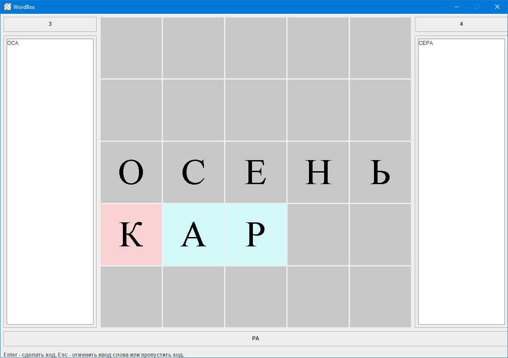
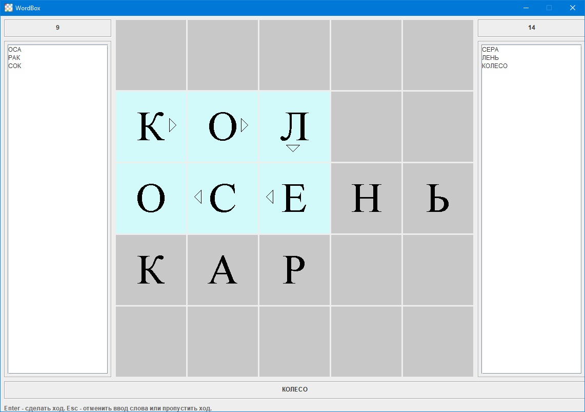
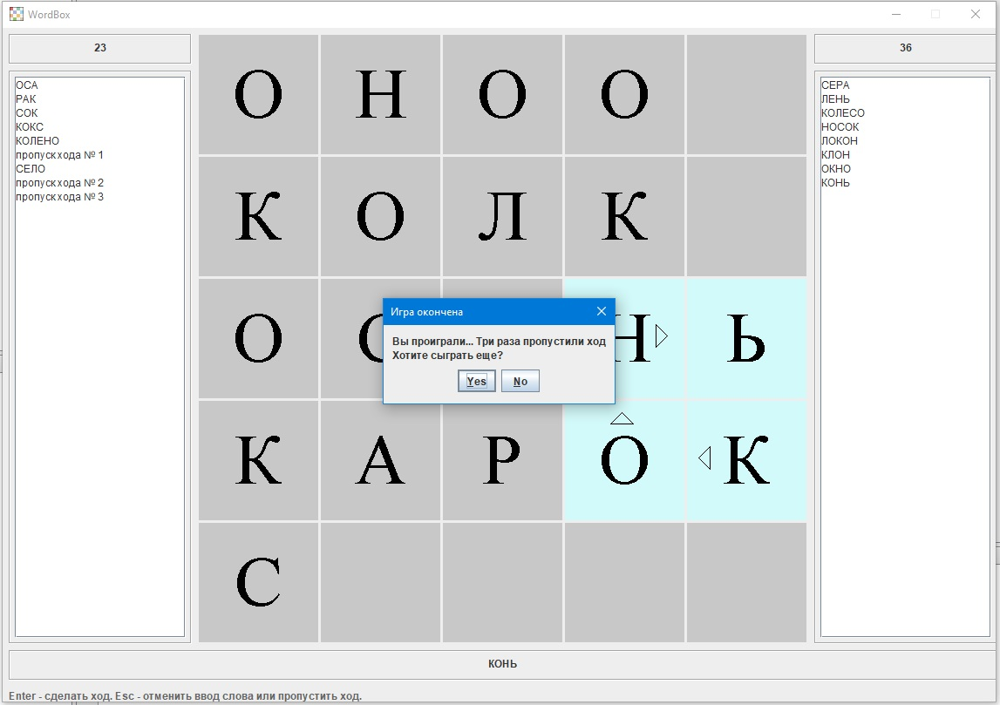

# WordBox
Простая игра на Java.
Суть игры в том, что игроки (человек и компьютер) поочередно добавляют на игровое поле буквы так, чтобы при каждом добавлении на поле появлялось новое слово. Чем длиннее слово, тем больше очков получает игрок. Ходы можно пропускать. Если игрок пропустил три хода, ему засчитывается поражение. Если поле заполнено и новые буквы вставлять уже некуда, то проигрыват тот, кто набрал меньше очков.

P.S. Некоторые классы содержат много "индусского кода", расставляющего по своим местам элементы интерфейса, но лишь потому, что ко времени написания программы я не успел изучить менеджеры компоновки)

